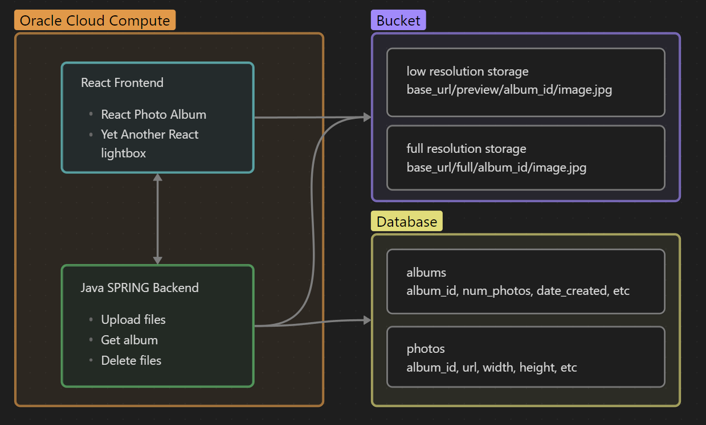

# Lightframe

Hello, welcome to another project that will likely soon be added to the Great GitHub Graveyard. 

## Purpose
There seems to be a distinct lack of templated DIY websites for setting up a fully featured photography portfolio. Of course there are the classics like squarespace, smugmug, and pixieset, but these are expensive and lock you into a company. On the fully DIY route, there are some GitHub projects that exist, but are usually incredible lacking in features and are often basically plain html and CSS with a bit of JavaScript. I'm sure there are projects out there that do actually exist, but I can't be bothered to find them, so instead I will spend months of my life recreating something that hundreds have made before. Because I'm a programmer, and that's what we do.

With this project I want to create a deployable website that has all the *main* bells and whistles. 
- A beautiful mosaic layout  for a main portfolio landing page
- Ability to upload large amounts of photos for long term storage
- Albums for photos to be organized into Albums in Collections
- Login/Authentication to allow for photo uploading
- Password protected albums?

## Tech Stack
I made this map 5 minutes before work don't make fun of me. You may be laughing because you think I forgot a database. But no I'm just cool like that. Databases are for losers, we will be storing everything we need in the S3 bucket. Album? Based on folder structure. Image size? In the file name. Index order? wait shit idk just do it by date. Checkmake SQLers.

Lowkey this will probably bite me in the butt later, and when that happens I will say holy fucking airball and double down.
> [!NOTE]
> Okay literally the next day I went back on my decision, not having a database is kinda stupid because you can't really get photo specific statistics or details. I am has dum.
### Frontend
- Node, React, Nginx
- Important libraries: [yet another react lightbox](https://github.com/igordanchenko/yet-another-react-lightbox), [react photo album](https://github.com/igordanchenko/react-photo-album)

### Backend
- Java with Spring API
- Yeah, java, because I write real code (cope)

We are keeping things simple because I want this to actually be a usable website by the time I retire. 

 